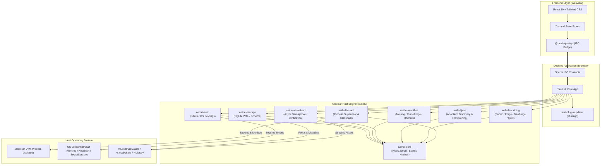
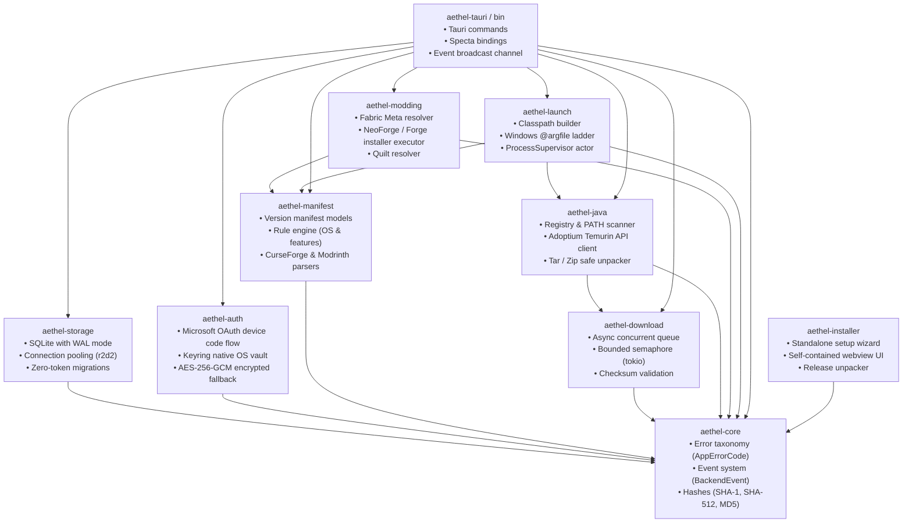
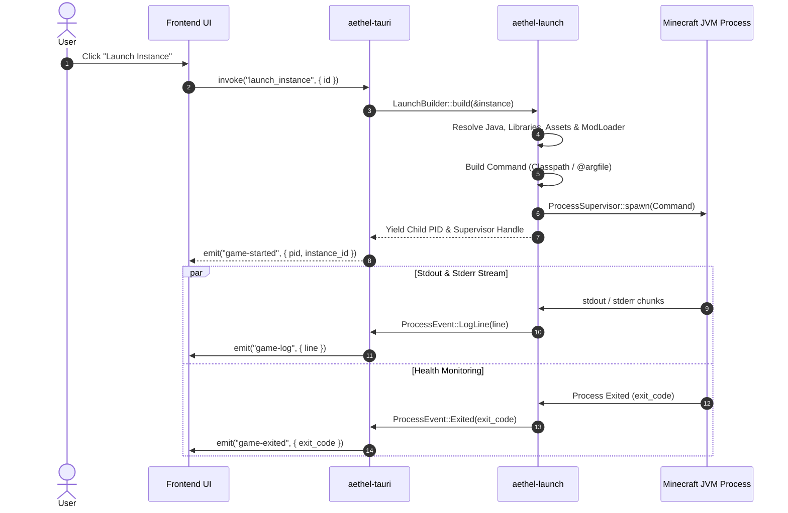

# Aethel Launcher — System Architecture & Design

This document details the architectural design, crate organization, concurrency models, and security boundaries of **Aethel Launcher**.

---

## 🏛️ High-Level System Architecture

Aethel Launcher is structured as a modular monorepo combining a high-performance **Rust** systems core with a modern, responsive **React 19** frontend orchestrated via **Tauri v2**.

---

## 📦 Crate Dependency Graph (DAG)

The Rust backend is separated into strictly decoupled domain crates:

---

## ⚡ Concurrency & Memory Management

1. **Async Runtime:**
   The backend runs on the `tokio` multi-threaded runtime. Heavy I/O operations (file streaming, network fetching, checksum computation) execute cooperatively without blocking the UI thread.

2. **Concurrency Throttling:**
   Downloads are bounded using `tokio::sync::Semaphore`. This prevents socket starvation and excessive file descriptor consumption when downloading thousands of game assets simultaneously.

3. **Zero-Copy & Streaming:**
   File downloads stream directly from network responses to disk using buffered asynchronous writers, keeping the launcher's memory footprint under **50MB** even during large modpack installations.

---

## 🎮 Process Supervisor Lifecycle

Game execution is strictly managed via the `ProcessSupervisor` lifecycle:

---

## 🔐 Security Boundaries & Invariants

| Domain | Mechanism | Threat Defended |
|---|---|---|
| **Credentials** | OS Native Credential Store (`wincred`, `Keychain`, `SecretService`) | Prevents plaintext token extraction by unauthorized local processes. |
| **Fallback Storage** | AES-256-GCM symmetric encryption with `0600` file permissions | Defends secrets in headless or containerized environments lacking keyrings. |
| **Database** | SQLite WAL mode strictly storing non-sensitive metadata | Zero-Token Invariant: database compromises yield zero credentials. |
| **Updater** | Minisign Ed25519 digital signatures | Blocks man-in-the-middle (MITM) and poisoned CDN updates. |
| **Archive Unpacking** | Canonicalized path validation on all zip/tar entries | Eliminates Zip Slip arbitrary file overwrite vulnerabilities. |
| **Command Line** | Windows `@argfile` argument file execution | Prevents Windows `32,767` character command-line truncation. |

---

## 💻 Standalone Installer Architecture

The installer (`crates/aethel-installer`) operates independently of the main application runtime:

1. **Lightweight Executable:** Compiled as a single static binary (~15MB compressed) with an embedded Vite React frontend.
2. **Permission-Safe Default Path:** Default install location targets `%LocalAppData%\Programs\Aethel Launcher` on Windows (and standard XDG/Applications on Linux/macOS), requiring zero UAC administrator elevation.
3. **Payload Streaming:** Connects to GitHub Releases API to stream the verified 64-bit production package with real-time download progress and hash verification.
4. **Clean Handshake:** Silently installs the target payload and launches the genuine application upon completion.
