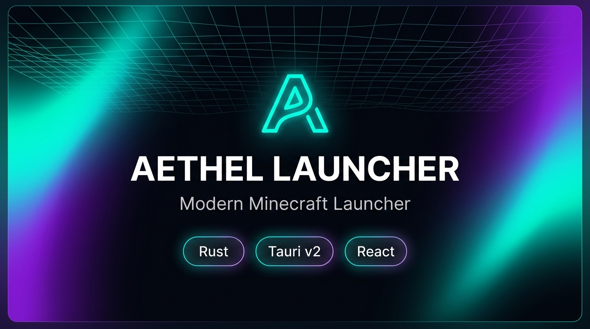
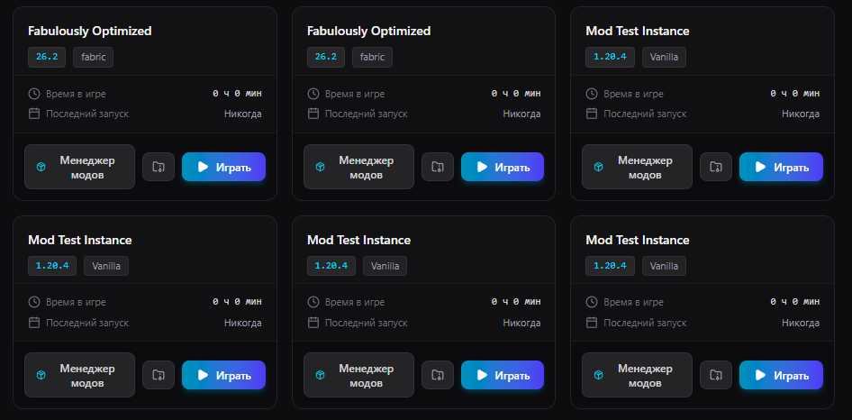
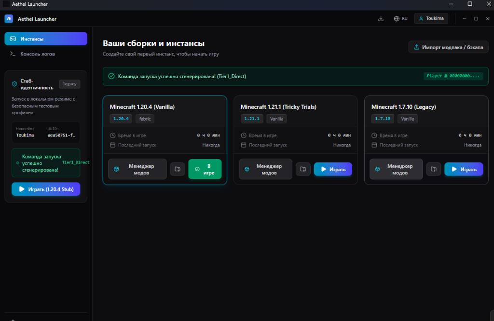
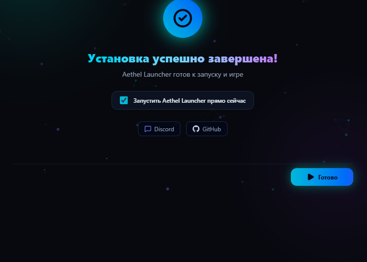
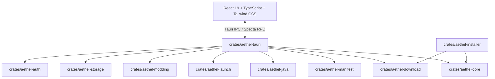

<p align="center">
  
</p>

<div align="center">

# 🌌 Aethel Launcher

**A modern, lightning-fast, and privacy-focused Minecraft launcher built with Rust & Tauri.**

[](https://github.com/Aethelis-Projects/Aethel-Launcher/actions/workflows/ci.yml)
[](https://github.com/Aethelis-Projects/Aethel-Launcher/releases/latest)
[](LICENSE)
[](https://discord.gg/minecraft)
[](https://www.rust-lang.org/)
[](https://v2.tauri.app/)

<p align="center">
  <a href="#-key-features">Features</a> •
  <a href="#-installation">Download</a> •
  <a href="#-quick-start">Quick Start</a> •
  <a href="#-architecture">Architecture</a> •
  <a href="#-building-from-source">Build from Source</a> •
  <a href="#-community--contributing">Contributing</a>
</p>

</div>

---

## ⚡ Why Aethel Launcher?

Most modern Minecraft launchers rely on heavy Chromium runtimes (Electron) that consume 500 MB+ of RAM before you even launch the game. **Aethel Launcher** was built from the ground up using **Rust and Tauri v2**, delivering a native, hyper-responsive experience with an idle footprint of under **45 MB RAM**.

Whether you play lightweight vanilla, complex 400+ mod packs on CurseForge, or optimize competitive PvP setups on Fabric, Aethel gives you total control without telemetry or telemetry lock-in.

### 📊 Competitive Comparison

| Feature | 🌌 **Aethel Launcher** | 💠 **Prism Launcher** | 🔮 **XMCL** | 📦 **Freesm Launcher** | 🐸 **FrogLauncher** |
| :--- | :---: | :---: | :---: | :---: | :---: |
| **Engine / Architecture** | **Rust + Tauri v2** | C++ / Qt 6 | Electron / Node.js | C++ / Qt | C# / .NET / WPF |
| **Idle Memory Footprint** | **~40–45 MB** | ~90–120 MB | ~350–550 MB | ~80–110 MB | ~150–250 MB |
| **Cold Startup Time** | **< 0.8s** | ~1.5s | ~3.5–5.0s | ~1.5s | ~2.0s |
| **CurseForge & Modrinth** | ✅ Native Dual-Engine | ✅ Full Support | ✅ Full Support | ⚠️ Partial | ⚠️ Partial |
| **Modpack Formats** | ✅ `.mrpack` + `.zip` | ✅ Full Support | ✅ Full Support | ⚠️ Limited | ⚠️ Limited |
| **Smart Java Provisioning**| ✅ Auto Adoptium/Zulu | ⚠️ Manual Detection | ✅ Auto Adoptium | ⚠️ Manual Detection | ⚠️ Bundled / System |
| **Realtime Crash Diagnostics** | ✅ Process Supervisor + mclo.gs | ⚠️ Raw Log View | ✅ Log Viewer | ⚠️ Basic Logs | ⚠️ Basic Logs |
| **Telemetry & Tracking** | 🛡️ **Zero (Strict Privacy)** | 🛡️ Zero | ⚠️ Optional Analytics | 🛡️ Zero | ⚠️ Telemetry |
| **Modern Frameless UI** | ✅ Cyberpunk Frameless | ❌ Classic Native Qt | ✅ Modern Frameless | ❌ Classic Native Qt | ⚠️ Basic Metro/WPF |

---

## ✨ Key Features

| Category | Highlights |
|---|---|
| ⚡ **Extreme Performance** | Native Rust backend, asynchronous multi-threaded download engine with parallel chunk streaming, instant sub-second launch times. |
| 📦 **Modding Ecosystem** | Full **Modrinth** and **CurseForge** integration. One-click install for **Fabric**, **Forge**, **NeoForge**, and **Quilt**. Support for `.mrpack` and `.zip` modpacks with dependency resolution. |
| ☕ **Smart Java Provisioning** | Automatically downloads, verifies, and configures the exact JRE (Adoptium Temurin / Zulu) required for your Minecraft version (Java 8, 17, 21). Optimized GC flag presets (G1GC, ZGC, Shenandoah). |
| 🔐 **Privacy & Authentication** | Microsoft Xbox Live OAuth 2.0 with PKCE, Authlib-Injector / custom Yggdrasil servers, and offline profiles. **Zero analytics, zero tracking, zero telemetry.** |
| 🛡️ **Rock-Solid Security** | Minisign Ed25519 cryptographic signature checks on all updates, strict Zip-Slip extraction protection, and sandboxed IPC capability boundaries. |
| 🎨 **Premium Frameless UI** | Cyberpunk-inspired dark aesthetic (`#07090e`), custom frameless titlebar with window management, rich markdown changelogs, and an animated 6-step installer. |
| 🩺 **Crash Diagnostics** | Real-time process supervisor with stdout/stderr streaming, automated exit code classification, stack trace extraction, and one-click paste to [mclo.gs](https://mclo.gs). |

---

## 🖼️ Screenshots

<table align="center">
  <tr>
    <td align="center" width="50%">
      <b>🎮 Main Instance Dashboard</b><br/>
      
    </td>
    <td align="center" width="50%">
      <b>📦 CurseForge & Modrinth Browser</b><br/>
      
    </td>
  </tr>
  <tr>
    <td align="center" width="50%">
      <b>✨ Custom Animated Installer</b><br/>
      
    </td>
    <td align="center" width="50%">
      <b>🔄 In-App Semantic Updater</b><br/>
      
    </td>
  </tr>
</table>

---

## 📥 Installation

Grab the latest release from the [**Releases Page**](https://github.com/Aethelis-Projects/Aethel-Launcher/releases/latest):

### 🪟 Windows (10 / 11, 64-bit)
- **Standalone Installer:** Download and run [`AethelInstaller-Windows-x86_64.exe`](https://github.com/Aethelis-Projects/Aethel-Launcher/releases/latest/download/AethelInstaller-Windows-x86_64.exe).  
  *Features an animated 6-step wizard, custom install directory, and optional Adoptium Java 21 auto-setup.*

### 🐧 Linux (x86_64)
- **Standalone Installer:** Download [`AethelInstaller-Linux-x86_64`](https://github.com/Aethelis-Projects/Aethel-Launcher/releases/latest/download/AethelInstaller-Linux-x86_64).
  ```bash
  chmod +x AethelInstaller-Linux-x86_64
  ./AethelInstaller-Linux-x86_64
  ```

### 🍏 macOS (macOS 11 Big Sur or newer, Apple Silicon & Intel)
- **Standalone Universal Installer:** Download [`AethelInstaller-macOS-universal`](https://github.com/Aethelis-Projects/Aethel-Launcher/releases/latest/download/AethelInstaller-macOS-universal).

---

## 🚀 Quick Start

1. **Launch Aethel Launcher** and click **«Создать инстанс» (Create Instance)**.
2. Choose your preferred **Minecraft version** (e.g., `1.21.1`) and **Modloader** (*Fabric, NeoForge, Forge, Quilt, or Vanilla*).
3. **Sign In:** Click on the account avatar in the top right:
   - Use **Microsoft Login** (browser PKCE flow) for official servers.
   - Or use **Offline Mode** with your custom username.
4. **Install Mods:** Open instance settings → **«Моды» (Mods)** to search Modrinth or drop `.jar` files directly.
5. **Import Packs:** Drag & drop any `.mrpack` or CurseForge `.zip` modpack onto the launcher window to import automatically.
6. Click **«Играть» (Play)** — the launcher resolves libraries, configures Java, and launches Minecraft in milliseconds!

---

## 🏗️ Architecture

Aethel Launcher is architected as a modular Rust workspace consisting of 10 isolated, highly-tested crates:



| Crate | Responsibility |
|---|---|
| [`aethel-core`](crates/aethel-core) | Core domain types, unified `AppError`, standard telemetry models, hashing primitives. |
| [`aethel-manifest`](crates/aethel-manifest) | Mojang v2 manifest parser, rule engine, client/server library resolver. |
| [`aethel-download`](crates/aethel-download) | Asynchronous parallel download engine, checksum validation (SHA1/SHA256), retry logic. |
| [`aethel-java`](crates/aethel-java) | Java runtime detection, Adoptium / Zulu JRE resolution, GC argument synthesis. |
| [`aethel-launch`](crates/aethel-launch) | Classpath assembly, process supervisor, stdout/stderr streaming, crash dump parsing. |
| [`aethel-modding`](crates/aethel-modding) | CurseForge API/CDN client, Modrinth API v2 client, zip slip validation, modpack importer. |
| [`aethel-storage`](crates/aethel-storage) | SQLite storage with WAL mode, instance profiles, game configurations. |
| [`aethel-auth`](crates/aethel-auth) | Microsoft Xbox Live OAuth 2.0 PKCE, Yggdrasil / Authlib-Injector, offline UUIDv3. |
| [`aethel-tauri`](crates/aethel-tauri) | Tauri v2 commands, typed IPC bridges with Specta, updater verification. |
| [`aethel-installer`](crates/aethel-installer) | Standalone modern installer wizard with silent NSIS execution and Minisign validation. |

---

## 🛠️ Building from Source

### Prerequisites

Ensure you have the following installed:
- [**Rust 1.80+**](https://rustup.rs/)
- [**Node.js 20+**](https://nodejs.org/) and `npm`
- **Platform Build Tools:**
  - **Windows:** C++ Build Tools (Visual Studio 2022)
  - **Linux (Ubuntu/Debian):**
    ```bash
    sudo apt-get update && sudo apt-get install -y \
      libwebkit2gtk-4.1-dev build-essential curl wget file \
      libxdo-dev libssl-dev libayatana-appindicator3-dev librsvg2-dev
    ```
  - **macOS:** Xcode Command Line Tools (`xcode-select --install`)

### Compilation Steps

```bash
# 1. Clone repository
git clone https://github.com/Aethelis-Projects/Aethel-Launcher.git
cd Aethel-Launcher

# 2. Install frontend dependencies
npm install

# 3. Run all tests
npm test                # 41 frontend suites
cargo test --workspace  # 104 Rust unit & integration tests

# 4. Start in development mode with Hot Module Replacement (HMR)
npm run tauri dev

# 5. Build production bundle
npm run tauri build
```

---

## 🤝 Community & Contributing

We welcome contributions from the community!
- 🐛 Found a bug? Open a report using our [Bug Report Template](https://github.com/Aethelis-Projects/Aethel-Launcher/issues/new?template=bug_report.yml).
- 💡 Have an idea? Submit a [Feature Request](https://github.com/Aethelis-Projects/Aethel-Launcher/issues/new?template=feature_request.yml) or start a discussion on [GitHub Discussions](https://github.com/Aethelis-Projects/Aethel-Launcher/discussions).
- 📜 Read our [**Contributing Guide (CONTRIBUTING.md)**](CONTRIBUTING.md) and [**Code of Conduct (CODE_OF_CONDUCT.md)**](CODE_OF_CONDUCT.md) before submitting Pull Requests.
- 🔒 Security vulnerability? Please follow our [**Security Policy (SECURITY.md)**](SECURITY.md).

---

## ⚖️ License

Aethel Launcher is dual-licensed under:
- **[MIT License](LICENSE-MIT)**
- **[Apache License, Version 2.0](LICENSE-APACHE)**

You may choose to use this project under either license at your option.

---

## ⚠️ Disclaimer

**Aethel Launcher is an independent open-source project and is NOT an official Minecraft product.**  
It is not approved by, endorsed by, or associated with **Mojang Studios**, **Microsoft Corporation**, or any of their subsidiaries. All trademarks and registered trademarks are the property of their respective owners.

---

<p align="center">
  Crafted with ❤️ by the <b>Aethelis Projects</b> team and community contributors.
</p>
